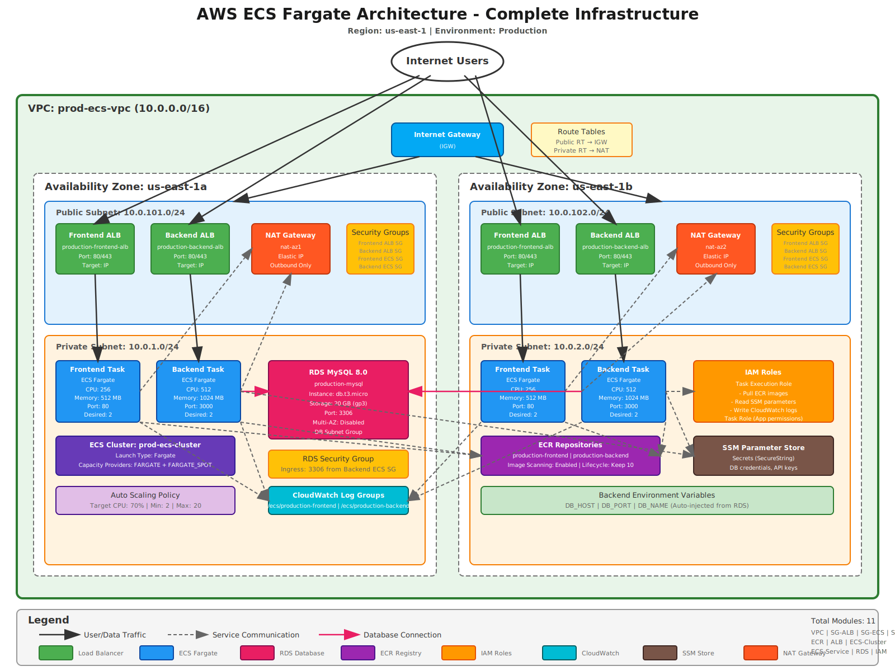

# ECS Fargate + RDS Terraform

This repository deploys a full **AWS ECS Fargate** application stack (frontend + backend) backed by an **RDS MySQL** database, all provisioned using **Terraform**.

## What This Project Deploys

- **VPC** (public + private subnets) with NAT gateways
- **ECS Fargate cluster** with two services (frontend + backend)
- **Application Load Balancers** (frontend + backend)
- **ECR repositories** for frontend and backend images
- **RDS MySQL instance** in private subnets
- **Security groups** allowing: ALB → ECS, ECS → RDS
- **IAM roles** for ECS task execution and service permissions
- **CloudWatch log groups** for ECS tasks

## Architecture Diagram



This diagram shows how the components are wired together (VPC, ALB, ECS, and RDS) and how traffic flows between them.

## Prerequisites

- AWS account with permissions to create VPC, ECS, IAM, RDS, ALB, etc.
- Terraform ≥ 1.5.0
- AWS CLI (optional, for secret management)

## Quick Start

### 1) Clone the repository

```bash
git clone <repository-url>
cd ecs-fargate-rds-terraform
```

### 2) Configure variables

Update `terraform.tfvars` with values appropriate for your environment. The repository includes an example configuration.

Key variables you likely need to change:

- `aws_region`: AWS region (default `us-east-1`)
- `environment`: Logical environment name (e.g. `production`)
- `cluster_name`: ECS cluster name
- `frontend_image`, `backend_image`: Your ECR image URLs (include tag)
- `db_name`: RDS database name
- `db_username_ssm_parameter` / `db_password_ssm_parameter`: SSM parameter paths for DB credentials

### 3) Create required SSM parameters (DB credentials)

By default, the module expects these parameters to exist:

- `/prod/rds/username`
- `/prod/rds/password`

Create them using the AWS CLI:

```bash
aws ssm put-parameter --name "/prod/rds/username" --value "dbuser" --type "SecureString" --region us-east-1
aws ssm put-parameter --name "/prod/rds/password" --value "supersecret" --type "SecureString" --region us-east-1
```

If you want to use different parameter names, update `db_username_ssm_parameter` and `db_password_ssm_parameter` in `terraform.tfvars`.

### 4) Deploy

```bash
terraform init
terraform plan
terraform apply
```

### 5) Verify

After apply, check output values:

```bash
terraform output frontend_alb_dns_name
terraform output backend_alb_dns_name
terraform output rds_endpoint
```

Then access the frontend using the ALB DNS.

## Important Terraform Variables

The following variables are defined in `variables.tf` and set in `terraform.tfvars`:

- `aws_region` (string)
- `environment` (string)
- `cluster_name` (string)
- `vpc_name` / `vpc_cidr` / `azs` / subnets / NAT configuration
- `frontend_image`, `backend_image` (ECR image URLs)
- `frontend_port`, `backend_port`
- `db_name`, `db_username_ssm_parameter`, `db_password_ssm_parameter`
- `db_allocated_storage`, `db_instance_class`
- `ssm_secret_names` (list of SSM parameter ARNs or names to inject as secrets)

## Outputs

After successful apply, these outputs are available:

- `frontend_alb_dns_name` – DNS name of the frontend ALB
- `backend_alb_dns_name` – DNS name of the backend ALB
- `ecs_cluster_name` – ECS cluster name
- `frontend_ecr_url` / `backend_ecr_url` – ECR repository URLs
- `rds_endpoint` / `rds_address` – RDS endpoint and address

## Notes

### Secrets

- DB credentials are pulled from SSM Parameter Store using the paths configured in `db_username_ssm_parameter` and `db_password_ssm_parameter`.
- Any additional secrets can be injected into ECS tasks using `ssm_secret_names`.

### Networking

- ECS tasks run in **private subnets** and communicate through an ALB in **public subnets**.
- The RDS instance lives in private subnets and is accessible only from the backend ECS service via security group rules.

## Cleanup

```bash
terraform destroy
```

## Project Structure

```
.
├── modules/
│   ├── alb/                # ALB + target groups
│   ├── ecs-cluster/        # ECS cluster (Fargate)
│   ├── ecs-service/        # ECS services + task definitions
│   ├── ecr/                # ECR repositories
│   ├── iam/                # IAM roles & policies
│   ├── rds/                # RDS MySQL instance
│   ├── security-groups/    # Security groups (ALB, ECS, RDS)
│   └── vpc/                # VPC, subnets, NAT, routing
├── main.tf                 # Root module wiring modules together
├── variables.tf            # Input variables
├── terraform.tfvars        # Example variable values (edit this)
├── outputs.tf              # Outputs
├── versions.tf             # Terraform provider versions
└── README.md               # This file
```

## License

MIT License
